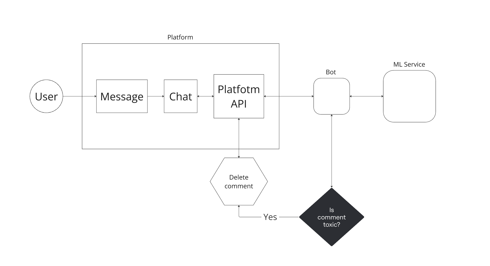

# Сценарий использования бота

## Основные функции

1. Модерация чата

Токсичные/негативные комментарии буду автоматически удаляться. Пользователи, которые пишут такие комментарии, будут получать временные блокировки (в случае, если блокировок будет много, пользователь будет блокироваться навсегда).

2. Анализ комментариев

Данные о комментариях будут собираться, и на их основе будет выводиться статистика по уровню токсичности в чате.

## Пример использования

1. Выставление базовых настроек бота (определение порога токсичности, за сколько нарушений пользователь блокируется и т.п.)
2. Стример начинает трансляцию, вместе с этим активируется бот
3. Каждый комментарий пользователя классифицируется как токсичный / не токсичный на основе базовых настроек. В случае определения комментария как токсичного он удаляется, для пользователя реализуется целевое действие (либо предупрждение, либо блокировка (временная или пожизненная) - в зависимости от настроек).

## Схема

